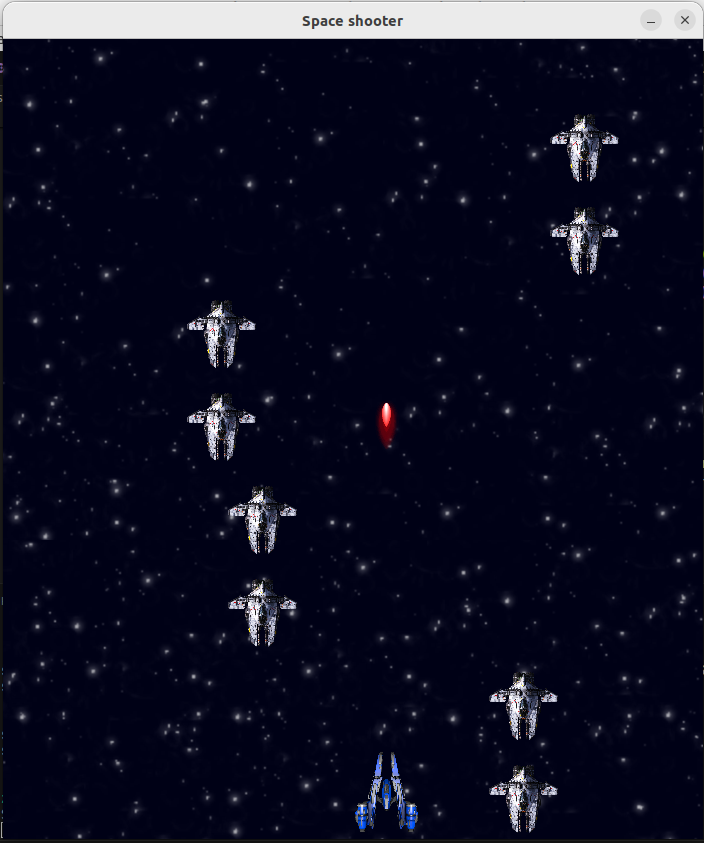

# Space_shooter

Project Space shooter is a simple game design in C++ with use of SFML library. Game allows the player to control space ship and fight enemies, while avoiding collision with objects.

# Game features
- **Spaceship Control**: The player can move vertically (A - left D -right or with arrows) and shoot(space) at enemies.
- **Enemies**: The game generates enemies that move towards the player, trying to destroy him.
- **Points and Results:**: The player earns points for killing enemies, and upon death his score is displayed.

# Classes and headers
There are 10 classes, header files are in the include folder and source files are in src. These Classes are called:
- **Statel (Only header file)**: serves as a starting point for creating specific states in the game by inheriting and implementing required methods. This approach allows games to easily manage different states such as menus, game screens, and pause screens.
- **StateManager**:  provides a mechanism for managing game states.
- **ResourceManager**: allows easy management of game resources by adding them and then retrieving them using specific identifiers.
- **StartScreen**: controls the display and interactions on the game's start screen, such as button selection and game initiation. It also has instructions on how to play.
- **Game**: serves as the entry point for launching and managing the entire game process. It utilizes Backend to manage game states, resources, and rendering windows.
- **GamePlay**: controls the main gameplay of the game, including player ship movement, bullet shooting, enemy ship appearance, and collisions between them.
- **Ship** - allows manipulation and rendering of the player's ship in the game and various functions to manage its properties such as position, velocity, and boundaries.
- **Bullet** - enables manipulation and rendering of bullets in the game and provides functions to manage their properties such as position and velocity.
- **Enemy** - enables manipulation and rendering of enemies in the game and provides functions to manage their properties such as position and velocity.
- **EndScreen** - controls the display and interactions on the game's end screen, such as button selection and restarting the game. The player's score achieved during the game is also displayed on this screen.
